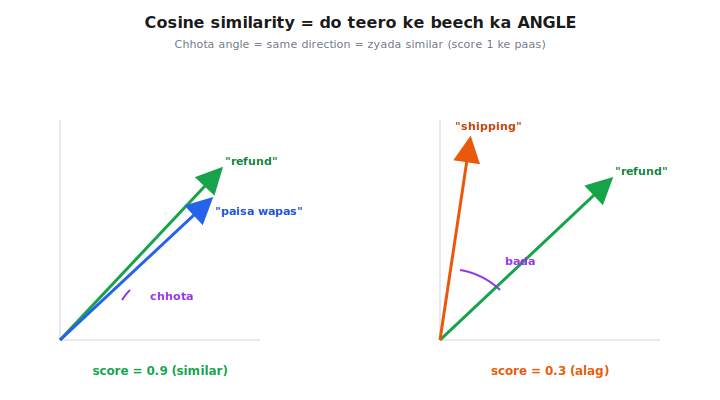
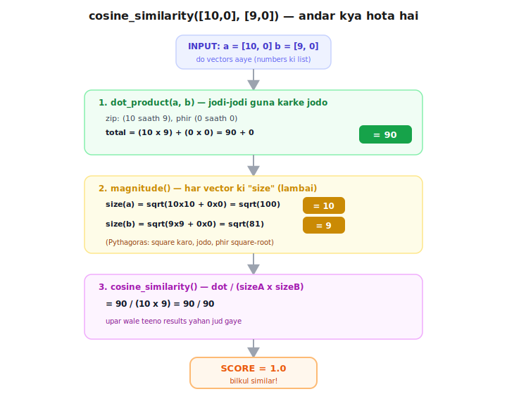
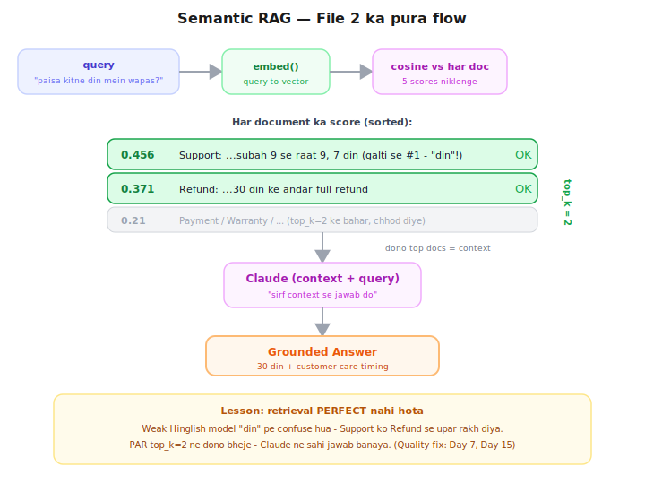

# Day 2 — Lecture Notes 📒

**Date:** 2026-06-30
**Topic:** Embeddings deep dive + Cosine Similarity (semantic search ki taiyaari)

> Yeh meri revise karne wali notes hain — sirf important cheezein + examples.

---

## 1. Cosine Similarity kya hai? (NEW term)



**Ek line:** do cheezo ke numbers dekh ke batana ki woh "ek hi disha/type" ki hain ya nahi.
Score milta hai **0 se 1**:
- **1** = bilkul same type (similar)
- **0** = bilkul alag type

### 🍮 Mithai wala example (yaad rakhne ke liye)
Har mithai ko 2 numbers se describe karo `[meetha, teekha]`:

| Cheez | meetha | teekha |
|-------|--------|--------|
| Gulab Jamun | 10 | 0 |
| Rasgulla | 9 | 0 |
| Samosa | 0 | 8 |

- Gulab Jamun vs Rasgulla → score **1.0** (dono meethe → similar ✅)
- Gulab Jamun vs Samosa → score **0.0** (ek meetha ek teekha → alag ❌)

---

## 2. Score banta kaise hai? — 3 chhote steps



Example: Gulab Jamun `[10,0]` vs Rasgulla `[9,0]`

**Step 1 — jodi-jodi guna karke jodo** (= "dot product")
```
(10 × 9) + (0 × 0) = 90
```

**Step 2 — har ek ki "size" nikalo** (= magnitude, Pythagoras)
```
size(GJ) = √(10² + 0²) = 10
size(RG) = √(9²  + 0²) = 9
```

**Step 3 — Step1 ko Step2 ke guna se baant do**
```
90 ÷ (10 × 9) = 90 ÷ 90 = 1.0  ✅
```

> Agar Step 1 hi 0 aaya (jaise Gulab Jamun vs Samosa), toh poora score = 0.

---

## 3. Asli connection — embeddings se

- Mithai mein **2 features** the `[meetha, teekha]`.
- Embeddings mein bas **384 features** hote hain (model unhe khud seekhta hai, naam nahi pata).
- Cosine wahi **3 steps** chalata hai — bas 2 ki jagah 384 numbers pe.
- Isiliye "refund" aur "paisa wapas" ka score high (same direction), "refund" vs "shipping" low.

**Frontend analogy:** Day 1 ka `array.filter(exact match)` → ab `array.sort(by similarity score)`.
Exact match nahi — **best match**.

---

## 4. Important real-world lesson ⚠️

Maine khud likha cosine (scratch) aur library — dono ka score **exactly same** (0.2746) aaya → math samajh gaya. ✅

PAR "refund chahiye" vs "paisa wapas karo" ka score sirf **0.27** aaya (kam laga).
**Wajah:** chhota model (`all-MiniLM-L6-v2`) mukhya roop se **English** pe trained, Hinglish kamzor samajhta.
**Lesson:** **model choice matters** — better/multilingual model = better scores. (Aage roadmap mein.)

---

## 5. Semantic RAG ban gaya (File 2)



Day 1 ka KEYWORD retrieve → ab SEMANTIC (cosine) retrieve.
**Flow:** `query → embed → har doc se cosine → top_k docs → Claude → answer`
Frontend: `filter(exact)` → `sort(by score).slice(0, top_k)`

### ⚠️ Live result se important lesson
Query: *"Mera paisa kitne din mein wapas aayega?"*
```
0.456 | Support doc  ← galti se TOP pe!
0.371 | Refund doc
```
- Support doc isliye upar aaya kyunki query mein **"din"** tha aur Support mein bhi **"7 din"**.
- Weak Hinglish model "din" pe confuse ho gaya. (English mein refund jeet jaata.)
- **PAR** `top_k=2` rakha tha → dono docs Claude ko gaye → Claude ne sahi jawab bana diya.
- **Lesson:** retrieval perfect nahi hota. `top_k > 1` safety deta hai. Quality improve karne ke
  liye better model + re-ranking aage aayega (Day 7, Day 15).

## 6. Bonus observation — LLM non-deterministic hota hai

Same query 2 baar chalai → retrieval bilkul same (0.456, 0.371) → par Claude ka **answer thoda alag**.
- LLM har baar thode alag shabdo mein likh sakta hai (jaise insaan).
- Ise **"temperature"** control karta hai (creativity knob; 0 = almost same har baar).
- Isliye RAG app testing mushkil — same input, slightly different output. (Eval: Day 12-13.)

> Side note: `NotOpenSSLWarning` sirf warning hai (purana Mac SSL), code theek chalta hai — ignore.

---

## Files
- `01_cosine_scratch.py` — cosine khud haath se banaya, library se match kiya ✅
- `02_semantic_rag.py` — semantic search (cosine) + Claude = full semantic RAG ✅
- `exercise.md` — aaj ke topic ke questions (agle din submit karne hain)
