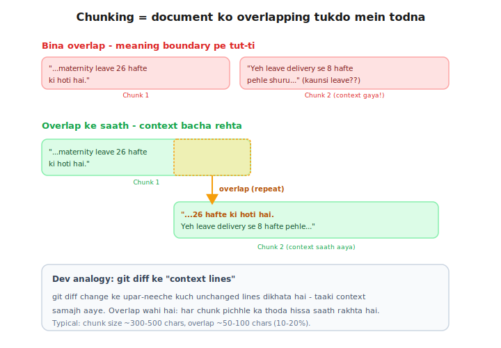

# Day 3 — Lecture Notes 📒

**Date:** 2026-07-07
**Topic:** Chunking — bade documents ko chhote overlapping tukdo mein todna

> Revise wali notes — sirf important cheezein + examples.

---

## 1. Chunking kyun? (bade docs ka problem)

Bade document (50-page PDF) ko as-is embed nahi kar sakte:

| Tarika | Problem |
|--------|---------|
| Poori book = 1 vector | Meaning "grey"/dhundhla ho jata (sab mix), + poori book LLM ko bhejni pade |
| Har shabd = 1 vector | Ek shabd ka context hi nahi ("leave" = kaunsi leave?) |
| **Paragraph-size CHUNKS** ✅ | Itna bada ki poori baat aaye, itna chhota ki precise rahe |

**Frontend analogy:** pagination — na poora data ek saath, na har item alag; page-by-page usable tukde.

---

## 2. Do zaroori decisions: chunk size + overlap

- **chunk_size** = ek tukda kitna bada (~300-500 chars typical)
- **overlap** = har chunk pichhle ka thoda hissa repeat kare (~10-20%)
- **Core formula:** `step = chunk_size - overlap` (har baar itna aage badho)

Example: size=30, overlap=10 → step=20 → chunks start at 0, 20, 40, ...

**Overlap kyun?** Boundary pe meaning tut-ti hai. Bina overlap:
`"...hoti hai. Ye" | "h leave..."` → "Yeh" shabd hi kat gaya!
Overlap se `"ki hoti hai. Yeh leave..."` → context bacha.

**Dev analogy:** overlap = `git diff` ke context lines (change ke aas-paas ki lines).

---

## 3. Scratch vs Library

**Scratch (character-based, `text[start:end]`):** simple, par WORDS tootte hain
(`technique` → `nique`, `Yeh` → `Ye`+`h`). Size exact rehta hai.

**Library (`RecursiveCharacterTextSplitter`):** smart. Ek separators PRIORITY LIST hoti hai:
`["\n\n", "\n", " ", ""]` = pehle paragraph pe todo, na ho to line, na ho to space
(word poora rehta!), last resort character. Isliye "recursive".
Size thoda flexible (37 vs 40) par chunks CLEAN.

**Trade-off:** scratch = exact size, tooti words. Library = clean words, flexible size.
Real apps mein clean jeet-ti. **Frontend analogy:** CSS `word-break: normal`.

---

## 4. Mentor comparison (coding_ninja_genai/session-03/02_docuement_chunking.ipynb)

Sir ne bhi SAME journey ki, aur ek extra tarika dikhaya:

| Step | Maine (rag-mastery) | Sir ne (mentor) |
|------|---------------------|-----------------|
| Character-based | ✅ `text[start:end]` + **overlap** | ✅ same, par overlap NAHI (cell 3) |
| Word-based | ❌ nahi kiya | ✅ **kiya** — words pe todke, word tootne se bachaya (cell 5) — bina library! |
| Library splitter | ✅ `RecursiveCharacterTextSplitter` | ✅ same (cell 13) + `CharacterTextSplitter(separator=".")` bhi |
| Real PDF | Day 6 mein karenge | ✅ `PyPDFLoader` se Bajaj policy PDF load (cell 14) |

**Naya seekha sir se:** **word-based chunking** — ek middle ground. Bina library ke bhi words
todne se bacha sakte hain: text.split() se words lo, ek-ek jodte jao jab tak size cross na ho,
phir naya chunk. (Yeh scratch aur library ke beech ka step hai.)

**Sir ka separator insight:** `separator="."` = sentence pe todna (period pe). Yeh Hinglish/English
policy text ke liye achha kaam karta hai.

---

## Files
- `01_chunking_scratch.py` — character-based chunking + overlap (scratch)
- `02_chunking_library.py` — RecursiveCharacterTextSplitter (smart, clean chunks)
- `exercise.md` — Day 3 homework
