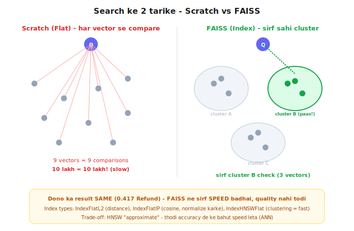

# Day 4 — Lecture Notes 📒

**Date:** 2026-07-08
**Topic:** Vector Store / FAISS — bahut saare vectors mein fast similarity search

> Revise wali notes — important cheezein + examples.

---

## 1. Problem: Day 2 ka search scale nahi karta

Day 2 mein query ko HAR EK doc se cosine karte the (exhaustive / "Flat").
- 5 docs = 5 comparisons → theek
- 10 lakh docs = 10 lakh comparisons **har query pe** → slow (O(n))

**Frontend analogy:** `array.filter()` millions of items pe = app hang.

---

## 2. Solution: INDEX (cache nahi!)

- **Cache** = pehle ka jawab yaad rakhna (sirf same query repeat ho tab kaam).
- **Index** = data ko smart tarike se organize karo taaki poora scan na karna pade.
  (kitab ka index / DB index / hash map `map.get()` = O(1) vs `array.find()` = O(n))

**FAISS = "vectors ke liye index."** (Facebook AI Similarity Search)

---

## 3. FAISS fast kaise? — clustering (mohalla trick)

- Vectors ko pehle se **clusters (mohalle)** mein baant do.
- Query aaye → sirf **sabse paas ke cluster** mein dhundo, poora nahi.
- Naam: **ANN = Approximate Nearest Neighbor**.
- **Trade-off:** "approximate" → kabhi 1-2 result miss ho sakte, par 1000x fast.
  (thodi accuracy de ke bahut speed lena — worth it jab lakhs of docs ho)

---

## 4. Code — scratch vs FAISS

**Scratch (`01_vectorstore_scratch.py`):** ek `class` (Angular service / React store jaisa)
- `__init__` = constructor (`self` = `this`)
- `add()` = text embed karke store, `search()` = exhaustive cosine (har vector se)

**FAISS (`02_faiss_library.py`):** same interface, fast andar
- `faiss.normalize_L2(vecs)` → length=1 → **inner product = cosine** (magnitude 1 to dot=cosine)
- `index = faiss.IndexFlatIP(384)` → index banao, `index.add(vecs)` → store
- `scores, indices = index.search(q, k)` → 2 cheezein: scores + kaunse doc (position)

**Proof:** dono ka result EXACT same (0.417 Refund, 0.403 Warranty).
FAISS ne sirf speed di, quality nahi todi. ✅

**Kahani:** scratch = "vector store karta kya hai" (samajhne ke liye);
FAISS = "wahi kaam production-scale pe" (millions-ready).

---

## 5. Mentor comparison (coding_ninja_genai/session-04/01_indexing.ipynb)

| Cheez | Maine (rag-mastery) | Sir ne (mentor) |
|-------|---------------------|-----------------|
| Vectors | real 384-dim (model se) | chhote HAAND-MADE 2D `[0.9,0.8]` (dekhne mein easy) |
| IndexFlatIP (cosine) | ✅ normalize + IP | ✅ same (cell 10) |
| IndexFlatL2 (distance) | ❌ nahi kiya | ✅ dikhaya (cell 4-9) — L2 = Euclidean distance, KAM = paas |
| **IndexHNSWFlat** (fast ANN) | concept samjhaya (mohalla) | ✅ ASLI code dikhaya (cell 11-13)! `efConstruction`, `efSearch` knobs |
| Memory calc | ❌ | ✅ `ntotal * dimension * 4 bytes` |

**Naya seekha sir se:**
- **IndexFlatL2** — cosine ke alawa "distance" se bhi similarity naapte (L2 mein KAM distance = zyada similar, cosine ke ULTA).
- **HNSW** = woh actual "clustering/graph" index jo search fast karta (humari mohalla-theory ka real code). Do knobs: `efConstruction` (build quality), `efSearch` (search quality vs speed).
- **Memory:** har vector `dimension * 4 bytes` (float32) leta — 10 lakh × 384 × 4 = ~1.5 GB. Isliye scale pe memory bhi soch-na padta.

---

## Files
- `01_vectorstore_scratch.py` — mini vector store class (add + exhaustive search)
- `02_faiss_library.py` — FAISS index (normalize + IndexFlatIP), same result fast
- `exercise.md` — Day 4 homework
