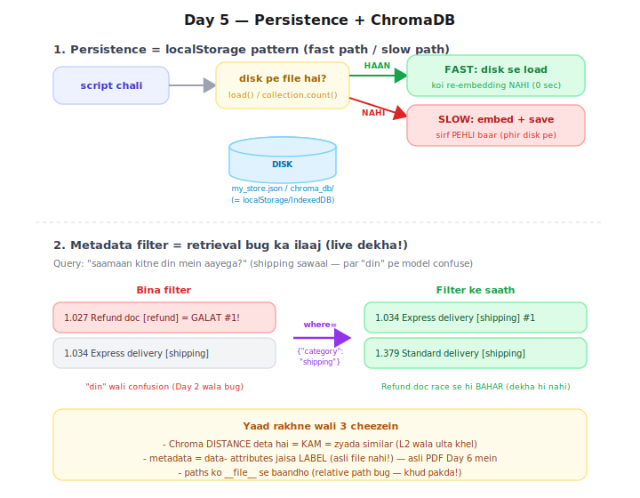

# Day 5 — Lecture Notes 📒

**Date:** 2026-07-14
**Topic:** Persistence + ChromaDB — vector data ko DISK pe rakhna (Phase 2 shuru 🟢)

> Revise wali notes — important cheezein + examples.

---

## 1. Problem: ab tak sab RAM mein tha

FAISS index / MiniVectorStore = **RAM mein** → script band = **sab gayab** → agli baar
saare docs **phir se embed** (5 lakh docs = ghanton ka kaam, har baar!).

**Frontend analogy (exact same):** JS variable page-refresh pe udd jata →
solution = `localStorage` / `IndexedDB` / API+DB. Vectors ke liye wahi cheez = **ChromaDB**.

---

## 2. Persistence pattern (fast path / slow path)



```
script chali → disk pe file HAI? → ⚡ load (0 sec, no re-embed)
                          NAHI?  → 🐢 embed (slow) + save → agli baar fast
```

Bilkul frontend caching pattern:
```js
const cached = localStorage.getItem("data");
if (cached) use(JSON.parse(cached));           // fast path
else { data = await fetchExpensive(); localStorage.setItem(...) }  // slow path
```

**Scratch (File 1):** `save()` = `json.dump` (= JSON.stringify + write), `load()` = `json.load`
(= JSON.parse). Pech: numpy array JSON mein nahi jata → `.tolist()` pehle (serializable banao).

---

## 3. 🐛 Real bug jo maine khud pakda — relative path!

`day-05/` ke andar se script chalai → `FileNotFoundError: day-05/my_store.json`
- **Relative path wahan se resolve hota jahan se RUN karte ho**, script ki jagah se nahi!
- Fix: `os.path.join(os.path.dirname(__file__), "my_store.json")` — path ko SCRIPT se baandho
- JS analogy: relative `` current page se resolve hota; Node ka `__dirname` = Python ka `dirname(__file__)`

---

## 4. ChromaDB — proper vector database

| Cheez | Scratch (File 1) | ChromaDB (File 2) |
|-------|------------------|--------------------|
| Persist | khud 30 lines (save/load) | **free** — `PersistentClient(path=...)` ek line |
| Embedding | khud `model.encode()` | **khud karta** (default model = wahi all-MiniLM!) |
| Metadata + filter | ❌ | ✅ `where={"category": "shipping"}` |
| Scale | RAM tak | proper DB |

**Concepts:**
- **Collection** = SQL table / IndexedDB object store; `get_or_create_collection` = persistence handle
- **add(ids, documents, metadatas)** — ids = primary key, metadata = labels
- **Metadata sirf LABEL hai** — `"source": "policy.pdf"` likhne se koi file load NAHI hoti
  (HTML `data-` attribute jaisa). Asli PDF loading = Day 6.
- **Chroma DISTANCE deta hai** (`dist=1.027`) → **KAM = zyada similar** (Day 4 ka L2 ulta khel)

---

## 5. 🎯 Metadata filter ne retrieval bug LIVE fix kiya

Query: *"saamaan kitne din mein aayega?"* (shipping sawaal)
- **Bina filter:** Refund doc galti se #1 (1.027) — "din" wala Day-2 confusion phir aaya!
- **`where={"category": "shipping"}`:** Refund doc race se hi BAHAR → Express delivery #1 ✅
- **Lesson:** metadata filtering sirf feature nahi — **retrieval quality ka hathiyar**.
  (Real app: user shipping page pe → filter lagao → galat category ka jawab aa hi nahi sakta)

---

## 6. Mentor comparison (session-04/02_chroma_db.ipynb + session-05/exploring_db.ipynb)

| Cheez | Maine | Sir ne |
|-------|-------|--------|
| Chroma access | **direct** `chromadb` library | **LangChain wrapper** (`langchain_chroma.Chroma`) — framework ke through |
| Embeddings | Chroma ka default (free, local) | **OpenAIEmbeddings** (text-embedding-3-small, 1536-dim, paid) |
| Documents | plain strings + metadata dicts | LangChain `Document` objects (page_content + meta) |
| **Pinecone** ☁️ | ❌ nahi kiya | ✅ session-05: **cloud vector DB** — create_index (dimension=1536, metric=cosine), PDF→chunks→Pinecone |

**Naya seekha sir se:**
- **Local vs Cloud vector DB:** Chroma = apne laptop/server pe (localStorage jaisa);
  **Pinecone = cloud managed** (Firebase jaisa) — scale + team ke liye, par paid + internet chahiye.
- Dimension **match** karna zaroori: OpenAI embeddings = 1536-dim → index bhi 1536 (mismatch = error).
- LangChain wrapper same kaam ko framework-style karta — Day 9 (LangChain) mein deep dive.
- Sir ka full flow session-05: **PDF → chunks (Day 3 skill!) → embeddings → Pinecone** — yahi humara Day 6 ka raasta hai.

---

## Files
- `01_persistence_scratch.py` — MiniVectorStore + save/load (localStorage pattern)
- `02_chroma_library.py` — ChromaDB: persist free + metadata + where-filter
- `exercise.md` — Day 5 homework
