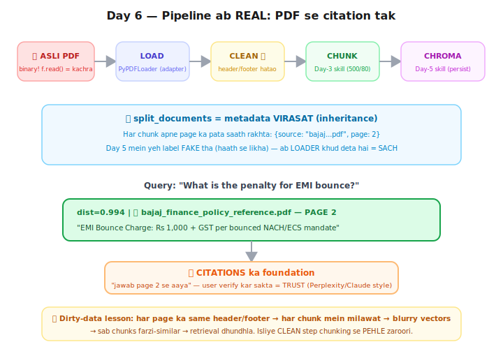

# Day 6 — Lecture Notes 📒

**Date:** 2026-07-19
**Topic:** Document Loaders — asli PDF se text nikaalna, pipeline REAL banana

> Revise wali notes — important cheezein + examples.

---

## 1. Problem: PDF binary hai

`f.read()` se PDF kholo toh kachra milta (`%PDF-1.4`, `/BaseFont /Helvetica`, objects...) —
asli text compressed **streams** mein daba hota. **Sahi parser chahiye.**

**Loader = adapter/parser** jo kisi bhi format ko **plain text + metadata** mein badal de.
Frontend analogy: API adapapters — JSON/XML/GraphQL jo bhi aaye, adapter common format deta,
aage ka code same rehta.

| Source | Loader |
|--------|--------|
| PDF | PyPDFLoader (pypdf wrapper) |
| Text | TextLoader |
| CSV | CSVLoader (rows → text) |
| Web | WebBaseLoader (HTML strip) |

---

## 2. Full REAL pipeline (aaj ka climax)



```
ASLI PDF → LOAD → CLEAN 🧹 → CHUNK (Day 3) → CHROMA (Day 5) → SEARCH + PAGE citation
```

Query *"What is the penalty for EMI bounce?"* → **PAGE 2: "Rs 1,000 + GST"** — exact jawab,
exact page. 12-page PDF, 40 chunks, sab khud dhundha.

---

## 3. 🧹 Dirty-data lesson (real-world ka pehla encounter)

PDF ke **har page pe same header/footer** tha ("BAJAJ FINANCE LIMITED... CONFIDENTIAL...").
Bina cleaning:
- har chunk mein **same milawat** → har vector aadha "header ka meaning" capture karta
- sab chunks **farzi-similar** ho jate (Day 3 ka "grey vector" problem, scale pe)
- retrieval dhundhla + chunk space waste + Claude ko kachra tokens

**Fix:** CLEAN step **chunking se pehle** — boilerplate strings replace karo, khali lines squeeze.
(Frontend analogy: API response se wrapper/`__typename` fields strip karna store karne se pehle.)

---

## 4. Document objects + metadata VIRASAT 🧬

- `loader.load()` → **Document** objects: `page_content` + `metadata` (source, page, total_pages...)
- **`split_documents()`** (vs Day 3 ka `split_text`): chunks banate waqt har chunk ko
  **apne page ka metadata inherit** karwata hai — chunk kahin jaye, apna pata saath.
- Day 5 mein `"source": "policy.pdf"` **FAKE** label tha (haath se likha) — ab **LOADER khud deta = SACH.**
- Note: pypdf metadata mein `page` **0-indexed** hota hai (isliye display pe +1 kiya).

---

## 5. 📚 Citations ka foundation

Retrieved chunk ke metadata se bata sakte hain: *"jawab policy.pdf ke PAGE 2 se aaya"* —
user verify kar sakta = **TRUST**. (Perplexity/Claude ke [source] wale answers isi pe bane hain.)
Yeh Phase-5 project mein UI feature banega.

---

## 6. Mentor comparison (session-03/01_docuemnt_loader.ipynb)

| Cheez | Maine | Sir ne |
|-------|-------|--------|
| PDF | pypdf (low-level) + PyPDFLoader | PyPDFLoader |
| Multi-format | ❌ sirf PDF | ✅ **TextLoader** (.txt) + **CSVLoader** (customers.csv rows→text) |
| Cleaning 🧹 | ✅ boilerplate removal | ❌ nahi kiya (raw as-is) |
| Full pipeline (→Chroma→search) | ✅ | is notebook mein nahi (session-05 mein Pinecone se kiya) |

**Naya seekha sir se:** **CSVLoader** — structured data (rows) ko bhi text bana ke RAG mein
daal sakte hain; har row ek Document banta hai.
**Mera addition:** cleaning step — jo sir ke notebook mein nahi tha, par real quality ke liye zaroori.

---

## Files
- `01_pdf_scratch.py` — pypdf se page-by-page extraction (binary → text)
- `02_loaders_library.py` — PyPDFLoader + clean + chunk + Chroma + cited search
- `sample_docs/` — mentor ki asli Bajaj policy PDF (12 pages)
- `exercise.md` — Day 6 homework
