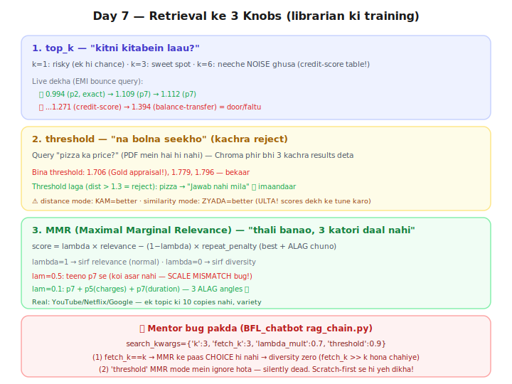

# Day 7 — Lecture Notes 📒

**Date:** 2026-07-21
**Topic:** Retrieval Quality — 3 tuning knobs (top_k, threshold, MMR)

> Revise wali notes — important cheezein + examples.

---

## Kahani: librarian ki training 📚
Retrieval system = naya librarian (40 chunks). 3 sabak:
1. **kitni kitabein laau** (top_k)  2. **na bolna** (threshold)  3. **variety** (MMR)



---

## 1. top_k — kitne chunks uthau?
- k kam = sahi chunk chhut sakta (ek hi chance)
- k zyada = **noise** ghusa (live: k=6 pe credit-score table + balance-transfer aaya, jo EMI se door)
- Sweet spot aksar **3-5**. (Day 4 exercise mein khud likha tha!)

## 2. Similarity threshold — kachra reject ("na bolna")
- Query ka jawab docs mein **na ho** to bhi Chroma top-3 deta hai (kuch to de dun).
- Live: "pizza price?" → Gold-appraisal/turnover jaisa kachra (dist 1.7+).
- **Fix:** distance/score pe cutoff. `if dist > 1.3: reject` → "Jawab nahi mila" (imaandaar, anti-hallucination).
- ⚠️ **distance mode: KAM=better; similarity mode: ZYADA=better** (ULTA!). LangChain
  `similarity_score_threshold` similarity use karta. **Threshold hamesha ASLI scores dekh ke tune karo**
  (humein 0.3 ne EMI query ko 0.003 se reject kar diya tha → 0.25 pe theek).

## 3. MMR — Maximal Marginal Relevance (variety)
**Full form todo:** *Marginal* = "naya kya jod raha" (2nd katori daal ki extra value ~0).
Formula: `score = lambda*relevance - (1-lambda)*repeat_penalty` → best + ALAG chuno.
- **fetch_k** = bade pool se candidates lao; **k** = unme se final chuno; **lambda_mult** = balance.
- Real life: YouTube/Netflix/Google — ek topic ki 10 copies nahi, variety. "Thali banao, 3 katori daal nahi."

### 🐛 Scale-mismatch bug (KHUD experience kiya)
- `relevance = -distance` (range ~0.3) vs `repeat = cosine` (range ~1) — **alag paimane!**
- lam=0.5 pe penalty sabko barabar lagi → ranking nahi badli (koi asar nahi).
- lam=0.1 pe diversity ki awaaz badhai → p7+p5+p7 (3 alag angles) ✅
- **Lesson (universal):** do alag metrics jodne se pehle **same scale (0-1) pe normalize karo**.
  (LangChain andar yahi karta — isliye uska lambda=0.5 pe kaam karta.)

---

## 4. 🐛 Mentor bug pakda! (BFL_chatbot/app/rag_chain.py — PRODUCTION project)
```python
vectorstore.as_retriever(search_type='mmr',
    search_kwargs={'k':3, 'fetch_k':3, 'lambda_mult':0.7, 'threshold':0.9})
```
- **Bug 1:** `fetch_k == k` (3==3) → MMR ke paas koi CHOICE nahi → **diversity zero**.
  Rule: **fetch_k >> k** (aksar 3-5x), warna MMR sirf naam ka.
- **Bug 2:** `'threshold': 0.9` MMR search_type ke saath **ignore** hota (sirf
  similarity_score_threshold mode mein chalta) → silently dead.
- **Yeh scratch-first ki jeet:** khud MMR banaya, isliye galti dikhi. Library copy-paste karte to kabhi na dikhti.

---

## Mentor comparison (session-06-07/03_retreiveal.ipynb)
- Sir ne yeh notebook **LlamaIndex** se kiya (Day 10 topic): `index.as_retriever(similarity_top_k=3)`,
  metadata filtering, QueryFusionRetriever. MMR ka asli config **BFL_chatbot project** mein tha.
- Concept same (top_k, filter, retriever) — bas framework alag (LlamaIndex vs Chroma/LangChain).

---

## Files
- `01_retrieval_tuning_scratch.py` — top_k / threshold / MMR khud (scale-mismatch live)
- `02_retrieval_library.py` — LangChain similarity_score_threshold + mmr retrievers
- `exercise.md` — Day 7 homework
