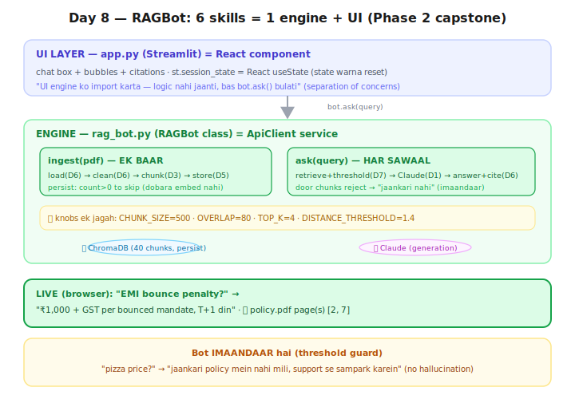

# Day 8 — Lecture Notes 📒

**Date:** 2026-07-21
**Topic:** End-to-End RAGBot (engine) + Streamlit UI — Phase 2 CAPSTONE 🎉

> Revise wali notes — important cheezein + examples.

---

## 1. Idea: 6 skills → ek reusable ENGINE



Ab tak sab alag: load→clean→chunk→embed→store→retrieve→generate.
Aaj ek `RAGBot` class mein baandha, 2 methods:
- **`ingest(pdf)`** — load(D6)→clean(D6)→chunk(D3)→store(D5) — **EK BAAR** (persist se skip)
- **`ask(query)`** — retrieve+threshold(D7)→Claude(D1)→answer+citation(D6) — **HAR SAWAAL**

**Frontend analogy:** ek `ApiClient` service class — ek baar banao, kahin bhi use karo
(CLI/Streamlit/React). **Engine UI se ALAG** = separation of concerns.

---

## 2. Streamlit UI (app.py) — browser chat

Streamlit = Python se web-UI. Har widget ek line (`st.title`, `st.chat_input`, `st.chat_message`).

**⚠️ Key gotcha (React se jodo):** Streamlit script har interaction pe **POORA re-run** hota
(top-to-bottom). Isliye state (`bot`, chat history) `st.session_state` mein rakhte hain —
bilkul React ka **`useState`** (warna har render pe reset ho jaye).

```python
if "bot" not in st.session_state:   # sirf pehli baar
    st.session_state.bot = RAGBot(); ...ingest...
```

**Run:** `streamlit run day-08/app.py`

---

## 3. LIVE result (browser mein test kiya) ✅
- "EMI bounce penalty?" → "₹1,000 + GST, T+1 din" + 📄 *page(s) [2,7]*
- "pizza price?" → "jaankari policy mein nahi mili, support se sampark karein" (threshold guard = imaandaar)

**Engine + UI dono kaam kar rahe.** Pehla complete, browser-based RAG product. 🚀

---

## 4. Design decisions (yaad rakhne layak)
- **Knobs ek jagah** (top of file): CHUNK_SIZE, OVERLAP, TOP_K, DISTANCE_THRESHOLD — config alag, code alag.
- **ask() dict return karta** (`{answer, sources}`) — UI ko structured data, jaise API JSON response.
- **ingest idempotent** (`count>0` to skip) — dobara chalao, dobara embed nahi.

---

## 5. Mentor comparison (session-04/session4_bajajbot_complete.ipynb)

| Cheez | Maine (RAGBot) | Sir ne (bajajbot) |
|-------|----------------|-------------------|
| Structure | ek `RAGBot` class (ingest/ask) | notebook cells, step-by-step |
| Data | asli PDF (load+clean) | haath se `Document` list (hardcoded policies) |
| Retriever | Chroma + distance threshold | `as_retriever(similarity, k=3, score_threshold=0.75)` |
| UI | ✅ **Streamlit browser chat** | ❌ notebook only |
| **Hybrid search** 🆕 | ❌ (abhi nahi) | ✅ **BM25 (sparse) + dense + EnsembleRetriever** |

**Naya seekha sir se — HYBRID / BM25:**
- **Dense** (embeddings/cosine) = MEANING se match (humne yahi kiya).
- **Sparse (BM25)** = KEYWORD/exact match (purana keyword search, par smart weighting).
- **Kab kaun jeeta:** exact product code "BFL-PL-2024" → BM25 wins (embeddings numbers/codes weak);
  "installment nahi de paunga" → dense wins (meaning).
- **EnsembleRetriever** = dono ko JOD do (best of both) — yeh Day 15 (re-ranking/advanced) mein deep karenge.
- **Mera addition:** proper class + real PDF + browser UI (sir ka concept-heavy, mera product-shaped).

---

## Files
- `rag_bot.py` — RAGBot engine class (ingest + ask + citations + threshold)
- `app.py` — Streamlit browser chat UI
- `sample_docs/` — Bajaj policy PDF
- `exercise.md` — Day 8 homework
