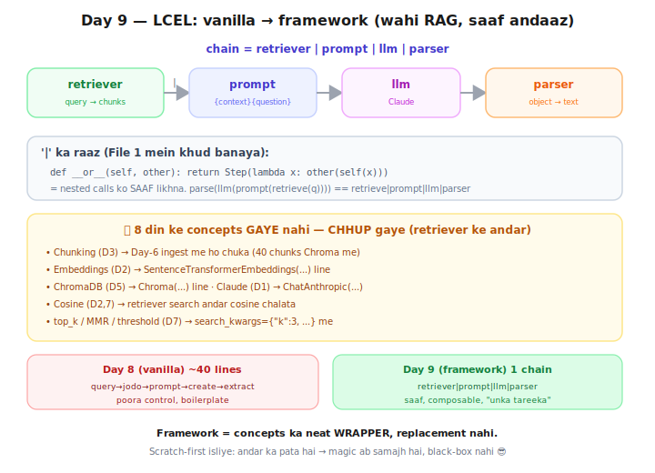

# Day 9 — Lecture Notes 📒

**Date:** 2026-07-21
**Topic:** LangChain LCEL — manual RAG → declarative pipe chain (Phase 3 shuru 🟡)

> Revise wali notes — important cheezein + examples.

---

## Kahani: vanilla JS → framework
Day 8 ka manual `ask()` = vanilla JS (sab haath se wire). LCEL = framework (declarative pipe).
Wahi RAG, saaf andaaz. Trade-off: framework = kam code + composable, par "unka tareeka" seekhna
padta + magic chhup jata.



---

## 1. LangChain kya hai (galatfehmi clear)
**LangChain = poore GenAI / Agentic AI apps ka framework** — RAG uska EK hissa.
(Jaise React = UI framework, RAG-jaisa kaam ek use-case.)
- LLM basics, RAG (retrievers/vectorstores), Memory, Tools, Agents, **LangGraph** (multi-agent).
- 🔗 Course ka CodeSentinel LangGraph pe tha = LangChain parivaar! RAG + Agents = ek hi framework.
- LangChain = broad; LlamaIndex (Day 10) = RAG-focused. Isliye alag din.

---

## 2. `|` (pipe) ka raaz — File 1 (scratch)
`|` koi jaadu nahi — Python operator overloading. `a | b` → andar `a.__or__(b)`.
```python
def __or__(self, other):
    return Step(lambda x: other(self(x)))   # "mera output tere ko de do"
```
= nested calls ko SAAF likhna:
`parse(llm(prompt(retrieve(q))))` == `retrieve | prompt | llm | parser`
(bina pipe: andar-se-bahar padho, ugly. pipe: baaye-se-daaye, kahani jaisi.)
**Frontend:** RxJS `pipe()`, Unix `cat | grep | sort`, function composition.

---

## 3. Asli LCEL chain — File 2
```python
chain = (
    {"context": retriever | format_docs, "question": RunnablePassthrough()}
    | prompt | llm | parser
)
chain.invoke("EMI bounce penalty?")
```
- Har piece ek **Runnable** (usme wahi `__or__` magic).
- **dict = parallel inputs**: prompt ko `context` (retriever se) + `question` (user) ek saath.
- **RunnablePassthrough** = input ko bina chhede aage bhej (React `{...props}` jaisa).
- Result: Day-8 ka 40-line `ask()` = ab ek chain. Wahi behaviour (EMI→Rs1000+GST; pizza→"jaankari nahi").

---

## 4. 🫣 Concepts GAYE nahi — CHHUP gaye (KEY insight)
`retriever` ek chhoti line, par andar 8 din:
- Chunking(D3)→ingest me ho chuka · Embeddings(D2)→`SentenceTransformerEmbeddings`
- ChromaDB(D5)→`Chroma(...)` · Cosine(D2,7)→retriever andar · top_k/MMR/threshold(D7)→`search_kwargs`
- Claude(D1)→`ChatAnthropic`
**Framework = concepts ka WRAPPER, replacement nahi.** Scratch-first ki jeet: andar ka pata → magic = samajh.

---

## 5. Mentor comparison (Projects/scam_guard/app/chain/scam_chain.py — PRODUCTION)
Sir ka scam-detector: `chain = prompt | llm | parser` (LCEL, same syntax!).

| Cheez | Maine | Sir ne (scam_guard) |
|-------|-------|---------------------|
| Chain | `retriever\|prompt\|llm\|parser` (RAG) | `prompt\|llm\|parser` (classification, no retrieval) |
| Parser | `StrOutputParser` (plain text) | **`PydanticOutputParser`** (structured object!) |
| Prompt | inline template | **prompt registry** (versioned prompts, `partial()` inject) |
| Structure | ek file | proper app: schemas/prompts/chain/config folders |

**Naya seekha sir se:**
- **PydanticOutputParser** 🆕 — LLM ko FORCE karo ki JSON/structured object de (jaise TypeScript
  interface). `ScamResult` schema → parser format_instructions prompt me daalta → LLM valid object deta.
  (StrOutputParser sirf text; Pydantic = typed, validated — production ke liye zaroori.)
- **Prompt versioning** — prompts registry me, version se pick (A/B test, traceability).
- **Frontend analogy:** PydanticOutputParser = API response ko ek TS interface se validate karna.

---

## Files
- `01_pipe_scratch.py` — `|` khud banaya (operator overloading, __or__)
- `02_lcel_chain.py` — asli LangChain LCEL RAG chain
- `exercise.md` — Day 9 homework
