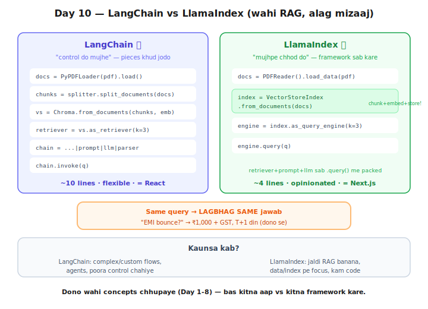

# Day 10 — Lecture Notes 📒

**Date:** 2026-07-21
**Topic:** LlamaIndex — doosra framework; LangChain vs LlamaIndex

> Revise wali notes — important cheezein + examples.

---

## Kahani: do dukaanein, alag mizaaj
- **LangChain** = bada general store (RAG+agents+memory) — pieces khud jodo ("control do mujhe")
- **LlamaIndex** 🦙 = RAG-specialist store — documents do, poocho, baaki woh sambhale ("mujhpe chhod do")
- Frontend: LangChain = **React** (flexible), LlamaIndex = **Next.js** (opinionated, batteries included)



---

## 1. LlamaIndex ka mental model (bahut chhota)
```
Documents → Index (auto: chunk+embed+store) → Query Engine → .query()
```
- `VectorStoreIndex.from_documents(docs)` = **ek line me chunk+embed+store** (Day 3+2+5 packed!)
- `index.as_query_engine(similarity_top_k=3)` = **retriever+prompt+llm sab ek me** (Day 7+1 packed)
- `engine.query(q)` = poora Day-9 chain = ek call

## 2. Code maatra — LangChain vs LlamaIndex (File 2 se, same query)
```
LangChain  (~10 lines): load→chunk→embed→store→retriever→prompt→llm→parser→chain→invoke
LlamaIndex (~4 lines):  load → from_documents → as_query_engine → query
```
**Result LAGBHAG SAME:** "EMI bounce?" → ₹1,000 + GST, T+1 din (dono se). Sirf ANDAAZ alag.

## 3. Concepts phir chhupe (Day 9 wala lesson repeat)
| Skill | LlamaIndex me kahan |
|-------|---------------------|
| Chunking (D3) | `from_documents()` ke andar (auto) |
| Embeddings (D2) | `Settings.embed_model` |
| Store (D5) | `VectorStoreIndex` (default in-memory) |
| Cosine + top_k (D2,7) | `as_query_engine(similarity_top_k=3)` |
| Prompt + Claude (D1) | `.query()` ke andar |
- LlamaIndex ne LangChain se bhi ZYADA chhupaya. Framework = wrapper, replacement nahi.

## 4. Kaunsa kab? (galat/sahi nahi — alag kaam)
- **LangChain:** complex/custom flows, agents, poora control chahiye.
- **LlamaIndex:** jaldi RAG, data/index pe focus, kam code.
- Ek achha dev DONO jaanta, situation dekh ke chunta.

## 5. ⚙️ Setup gotcha (real-world lesson)
- Python 3.9 + latest LlamaIndex = clash (`Path | None` syntax needs 3.10+). Fix: older version pin
  (`llama-index-core==0.11.23`).
- `llama-index-llms-anthropic` humare `anthropic` SDK se version-clash. **Fix:** Day-9 ka
  `ChatAnthropic` (LangChain) ko `LangChainLLM(...)` se LlamaIndex me plug kiya — **frameworks
  aapas me connect** ho sakte (LlamaIndex ne LangChain LLM use kiya). Yeh bhi ek seekh.

---

## 6. Mentor comparison (session-06-07/01_why_llma_index + 02_basic_llama_index)
Sir ne EXACT same journey ki:
- `01_why_llma_index` = pehle **LangChain** se RAG (retriever + prompt|llm chain) — "kyun kuch aur chahiye"
- `02_basic_llama_index` = phir **LlamaIndex**: `SimpleDirectoryReader → VectorStoreIndex →
  as_query_engine → query` (bilkul humara pattern!)

| Cheez | Maine | Sir ne |
|-------|-------|--------|
| LlamaIndex reader | `PDFReader` | `SimpleDirectoryReader('data_test')` (poora folder auto) |
| LLM | Claude (via LangChainLLM bridge) | OpenAI (gpt-3.5/4o-mini) |
| Embedding | HuggingFace all-MiniLM | same HuggingFace all-MiniLM |
| Extra | side-by-side compare | `pprint_response(show_source=True)` (citations dekhna) |

**Naya seekha sir se:** `SimpleDirectoryReader('folder')` = poora folder ke sab files auto-load
(PDF/txt/docx) — ek line me multi-file ingestion. `pprint_response(show_source=True)` = jawab +
source nodes ek saath (LlamaIndex ka built-in citation view).

---

## Files
- `01_llamaindex_rag.py` — LlamaIndex se RAG (Documents→Index→QueryEngine)
- `02_langchain_vs_llamaindex.py` — same query, dono framework side-by-side
- `exercise.md` — Day 10 homework
