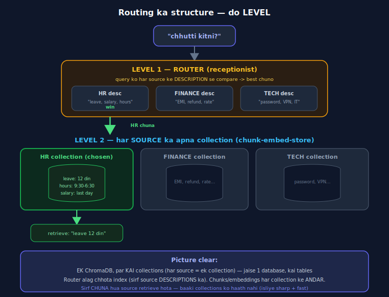

# Day 11 — Lecture Notes 📒

**Date:** 2026-07-21
**Topic:** Query Routing — kai sources me se sahi pe bhejna

> Revise wali notes — important cheezein + examples.

---

## Kahani: reception pe baithi ladki 🏢
Har sawaal sun ke sahi department bhejti (khud jawab nahi deti). Router = wahi "receptionist"
— query dekh ke decide kare kaunsa SOURCE.
**Frontend:** React Router — URL dekh ke component; yahan URL ki jagah query ka MEANING.

---

## 1. Routing architecture — do LEVEL

- **LEVEL 1 — Router:** sirf source DESCRIPTIONS ka chhota index. Query → best source chuno.
- **LEVEL 2 — Har source ka apna collection:** asli docs → chunk → embed → store.
- **Structure:** EK ChromaDB, KAI collections (1 db, kai tables). Router alag chhota index.
- Sirf CHUNA hua source retrieve hota → baaki ko haath nahi → **sharp + fast**.

**Kyun routing:** sab ek DB me thoso → blurry/confused retrieval. Alag sources + routing → focused.

---

## 2. Do tarah ke router

**File 1 — Embedding router (scratch):** query ko source descriptions se cosine → best.
- Fast, free. PAR weak model = galti ("chhutti" score sirf 0.12, atka).

**File 2 — LLM router (Claude):** Claude ko sources do, woh MEANING se chune.
- "chhutti kitni?" → HR ✅  ·  "paisa wapas kab?" → FINANCE ✅ (bina "refund" shabd!)
- Slow + thoda paisa, par nuanced/overlapping queries pe smart.

| | Embedding router | LLM router |
|---|---|---|
| decide | cosine | Claude sochke |
| speed | fast/free | slow/paisa |
| kab | sources bahut alag | nuanced queries |

---

## 3. 🎯 AGENTS ki jhalak (bada insight)
Ab tak Claude sirf JAWAB deta tha. Aaj Claude ne **FAISLA** liya ("yeh query FINANCE pe jaye").
**Jab LLM decide karne lage → wahin se AGENT banta hai.**
- Course connection: CodeSentinel jo decide karta kaunsa tool; MAS Manager jo specialist chunta.
- Routing = agent ki NEENV. rag-mastery Day 17-18 (Agentic RAG) ka pehla step. 🔗

---

## 4. Mentor comparison (session-06-07/04_routing.ipynb)
Sir ne EXACT same idea:
- 3 sources: HR / Product (NovaCRM) / Finance — har ek ka apna **Pinecone index**.
- `QueryEngineTool` (har source ko ek "tool" banaya, description ke saath).
- `RouterQueryEngine` + **`LLMSingleSelector`** = LLM-based routing (humara File 2 jaisa!).

| Cheez | Maine | Sir ne |
|-------|-------|--------|
| Sources | HR/FINANCE/TECH (inline) | HR/Product/Finance (real PDFs) |
| Store | in-memory / Chroma collections | **Pinecone** (per-source index) |
| Router | scratch cosine + LLM (Claude) | `RouterQueryEngine` + `LLMSingleSelector` (LLM) |
| Naya word | — | **QueryEngineTool** = source ko "tool" banana (agents vocabulary!) |

**Naya seekha sir se:** har source ko **QueryEngineTool** banaya jaata (name + description) — yeh
bilkul agents ke `@tool` jaisa! Router in tools me se chunta. Yani **routing = "tool selection"**
ka RAG version → agents ka direct connection.

---

## Files
- `01_router_scratch.py` — embedding-based router (cosine to source descriptions)
- `02_router_llm.py` — LLM (Claude) based router (meaning se, agents ki jhalak)
- `exercise.md` — Day 11 homework
