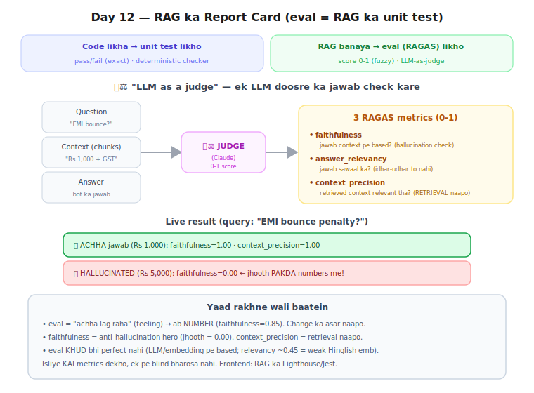

# Day 12-13 — Lecture Notes 📒

**Date:** 2026-07-21
**Topic:** Evaluation (RAGAS) — RAG ka report card (kitna achha hai, NUMBERS me)

> Revise wali notes — important cheezein + examples.

---

## Kahani: eval = RAG ka unit test
Code likha/modify kiya → unit test likho (kaam karta ya toota).
RAG banaya/modify kiya → **eval (RAGAS)** likho (quality achhi ya giri).
Maksad same: "jo banaya sahi hai kya + change ka asar naapo."

**Jargon:**
- **eval** = evaluation = "kitna achha hai, naapo aur score do" (exam/Lighthouse jaisa)
- **RAGAS** = RAG Assessment = RAG-testing library (RAG ka Jest/Lighthouse)
- **datasets** = data ko table (rows+cols) me rakhne wali lib; har row = ek eval test-case;
  RAGAS iska `Dataset` format maangta (uska "props/schema")



---

## 1. Unit test vs RAG eval (naazuk farak)
| | Unit Test | RAG Eval |
|---|-----------|----------|
| output | pass/fail (exact) | score 0-1 (fuzzy) |
| answer | ek exact sahi | koi single sahi nahi (LLM non-deterministic) |
| checker | code (`toBe`) | doosra LLM (judge) |
Kyun: "EMI bounce penalty?" ka jawab har baar thoda alag shabdo me (dono sahi) →
exact match kaam nahi karta → 0-1 score + LLM judge chahiye.

## 2. "LLM as a judge" 🧑‍⚖️
Ek LLM (Claude) se DOOSRE ka jawab check karwao: "yeh answer context pe faithful hai? 0-1 do."
Exam checker jaisa. (max_tokens=10, "sirf number do" — clean output.)

## 3. 3 RAGAS metrics (har 0-1)
- **faithfulness** — jawab context pe based? (jhooth = hallucination check) ← HERO metric
- **answer_relevancy** — jawab sawaal ka? (idhar-udhar to nahi)
- **context_precision** — retrieved context relevant tha? (RETRIEVAL naapo, answer nahi)
  (RAGAS 0.4.3 me `reference` = ground truth chahiye iske liye)

## 4. Live result (query "EMI bounce penalty?")
```
                 faithfulness  answer_relevancy  context_precision
✅ ACHHA (Rs1000)   1.00          0.44              1.00
❌ HALLUC (Rs5000)  0.00          0.46              1.00
```
- **faithfulness ne hallucination PAKDA** (Rs5000 context me nahi tha → 0.00). Hero.
- context_precision dono 1.00 (retrieval sahi tha dono baar — answer nahi, RETRIEVAL naapta).
- answer_relevancy ~0.45 (kam) — andar embeddings use karta, WEAK Hinglish model.

## 5. ⚠️ Bada lesson — eval khud bhi perfect nahi
Eval numbers deta hai PAR eval bhi LLM/embedding pe based → khud galti kar sakta
(relevancy shaky yahan). Isliye **kai metrics** dekho, ek pe blind bharosa nahi.

## 6. Kyun zaroori (production)
Bina eval → guess karke tune (andha). Eval se → har change (chunk_size/top_k/model) ka
asar NAAPO → systematically improve. Capstone SaaS me = quality dashboard.

---

## 7. Mentor comparison
**session-08/rag_assesment.ipynb:** RAGAS use ki (ContextPrecision + gpt-4o-mini judge) — humara File 2 jaisa.

**Projects/hireflow/generation/eval_chain.py (PRODUCTION!):** LLM-as-judge ko REAL use-case me lagaya —
resume ko job-description ke against SCORE karna. `chain = prompt | llm | parser` (Day-9 LCEL!) +
**PydanticOutputParser** (`CandidateEvaluation` structured object — Day-9 concept!). Async `ainvoke`.

| Cheez | Maine | Sir ne |
|-------|-------|--------|
| RAGAS metrics | faithfulness/relevancy/context_precision | ContextPrecision (session-08) |
| Judge LLM | Claude | gpt-4o-mini |
| Real product eval | scratch judge | **hireflow**: candidate scoring (LCEL + Pydantic) |

**Naya seekha:** eval sirf "RAG test" nahi — **LLM-as-judge** ek general pattern hai. hireflow me
resume-vs-JD scoring bhi wahi (candidate ko 0-1 grade). Structured output (Pydantic) se judge ka
result programmatically use hota (rank/filter candidates).

---

## Files
- `01_eval_scratch.py` — LLM-as-judge khud (faithfulness + relevance, 3 test cases)
- `02_ragas_library.py` — asli RAGAS (3 metrics, Claude+local emb plugged)
- `exercise.md` — Day 12-13 homework
