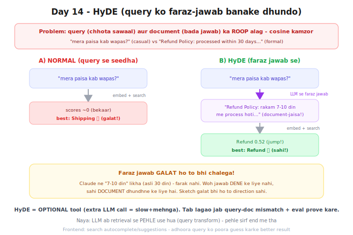

# Day 14 — Lecture Notes 📒

**Date:** 2026-07-21
**Topic:** HyDE (Hypothetical Document Embeddings) — Phase 4 Advanced RAG shuru 🟣

> Revise wali notes — important cheezein + examples.

---

## Full form
**H**ypothetical **D**ocument **E**mbeddings = "faraz (kaalpanik) jawab ka embedding"

## Kahani: sawaal se dhundhna mushkil
Query (chhota, casual sawaal) aur Document (bada, formal jawab) ka ROOP alag →
cosine kamzor. HyDE fix: pehle query ko ek FARAZ jawab bana lo (document-jaisa),
phir usse search karo.



---

## 1. Problem (kyun HyDE)
```
QUERY:    "mera paisa kab wapas aayega?"  (chhota, casual)
DOCUMENT: "Refund Policy: processed within 30 days..."  (bada, formal)
```
Matlab same, likhne ka roop alag → cosine score kamzor → galat retrieval.

## 2. HyDE ka fix
```
query → LLM se FARAZ jawab banwao → us jawab ko search
```
Faraz jawab document-jaisa dikhta → asli document se better match.

## 3. Live result (`01_hyde_scratch.py`)
```
A) NORMAL (query se): scores ~0 → best: Shipping ❌ (galat!)
B) HyDE (faraz se):   Refund 0.52 (jump!) → best: Refund ✅ (sahi!)
```
Query "paisa wapas" itni casual thi ki normal search galti se Shipping laya.
HyDE ne faraz "Refund Policy..." banaya → sahi Refund doc mila.

## 4. 🎯 KEY: faraz jawab GALAT ho to bhi chalega
Claude ne "7-10 din" likha (asli 30 din) — farak nahi padta! Woh jawab DENE ke liye
nahi, sahi DOCUMENT dhundhne ke liye. (Sketch galat bhi ho to direction sahi.)

## 5. Naya concept
Pehli baar LLM **retrieval se PEHLE** use hua (query transform) — ab tak LLM sirf
END me (jawab banane) aata tha. Yeh "query transformation" ka pehla example.

## 6. ⚠️ Production reality (important)
HyDE har app me ZAROORI NAHI — ek OPTIONAL tool hai:
- Extra LLM call (faraz jawab) = **slow + mehnga** (2x LLM calls per query)
- Zyadatar apps me simple retrieval kaafi (jaise Bajaj bot)
- Tab lagao jab: query-doc mismatch + eval (Day 12) se PROVE ho ki better hua
- Frontend analogy: lazy-loading/code-splitting — har app me nahi, jab problem ho tab

## Note: Mentor comparison
HyDE mentor repo me NAHI hai — yeh **rag-mastery ka bonus depth**. (Advanced techniques
toolbox: HyDE, re-ranking Day15, multi-query Day16 — problem dekh ke sahi tool uthao.)

---

## Files
- `01_hyde_scratch.py` — HyDE from scratch (normal vs HyDE retrieval compare)
- `exercise.md` — Day 14 homework
