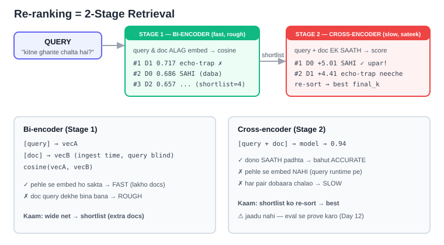

# Day 15 — Re-ranking (2-Stage Retrieval) 🟣

> Phase 4 (Advanced RAG). Retrieval ko **do stage** me tod ke behtar banana.

---

## 1. Problem (kyun chahiye)

Abhi tak retrieval = **bi-encoder** (Day 2 wala cosine):
- Documents **ingest time** pe embed hote hain → us waqt **query maujood nahi hoti**.
- Isliye doc ka vector "general-purpose" hai (query ko dekhe bina bana) → match **ROUGH**.
- Analogy: ek hi **general resume** har job ke liye — specific job dekhke nahi bana → rough match.

Kabhi-kabhi galat doc top pe aa jata hai (query ke shabd copy karne wala, par jawab na dene wala).

---

## 2. Fix — Re-ranking = 2 stage



| Stage | Model | Kaam | Speed |
|-------|-------|------|-------|
| 1 | **Bi-encoder** (all-MiniLM) | cosine se **shortlist** (thode EXTRA candidates) | fast, rough |
| 2 | **Cross-encoder** (ms-marco) | query+doc **EK SAATH** dekh ke score → **re-sort** | slow, sateek |

- **Bi-encoder:** `[query]→vecA`, `[doc]→vecB` alag → `cosine`. Doc pehle se embed → FAST.
- **Cross-encoder:** `[query + doc] → model → 0.94`. Dono saath → ACCURATE, par pehle se embed **nahi** ho sakta (query runtime pe aati) → sirf shortlist pe chalao (poore DB pe nahi).

**Shortlist me EXTRA docs kyun?** Re-ranker sirf usi maal me se chunta jo Stage 1 deta — naya doc nahi laata. Isliye jaal thoda chowda phenko (best doc kahin aa hi jaaye), phir re-ranker upar le aata.
- Bahut kam (sirf 3) → best doc chhoot jaye. Bahut zyada (poora DB) → re-ranker **slow**. Sweet spot: 20-50.

---

## 3. LIVE result (SonicWave example)

Query: *"How many hours does the SonicWave speaker play on one charge?"*

```
STAGE 1 (bi-encoder):  #1 D1 0.717 (echo-trap, jawab nahi)   #2 D0 0.686 (SAHI, daba)
STAGE 2 (cross L-12):  #1 D0 +5.01 (SAHI upar!) ✅            #2 D1 +4.41 (trap neeche)
```
- Bi-encoder query-shabd echo (D1: "hours...speaker...charge") pe fisla.
- Cross-encoder ne D0 me chhupa asli jawab ("eighteen hours", "SonicWave") pakad ke #1 kiya.

---

## 4. 3 BADI seekhein (mehnat se mili)

1. **Accha bi-encoder chhote saaf data pe aksar #1 sahi deta.** Humne 4 corpus try kiye (days-trap, echo-trap, "return" polysemy, buried warranty) — har baar all-MiniLM ne #1 sahi diya. → Re-ranking **OPTIONAL enhancement** hai (Day 14 HyDE jaisa), har jagah nahi.
2. **Re-ranking ULTA bhi kar sakta.** Entity-confusion case ("return window for electronics") me cross-encoder ne sahi jawab **neeche** dhakel diya (exact phrase "return window" pe fisal gaya). → **Hamesha eval (Day 12) se prove karo** fayda hua ya nahi.
3. **Reranker ki QUALITY matter karti.** Chhota `ms-marco-MiniLM-L-6` fail (echo-trap #1), bada `L-12` pass (D0 #1). Jaise embedding model weak/strong hota, waise reranker bhi.

---

## 5. Kab lagao / kab nahi

- ✅ **Lagao:** bada + noisy corpus, subtle distinctions, jab eval me score badhe.
- ❌ **Mat lagao:** chhota saaf corpus jahan bi-encoder pehle hi sahi, ya jab eval me fayda na dikhe (extra latency+cost bekaar).
- **Frontend analogy:** autocomplete (fast list) → phir dhyaan se sort. Ya hiring: ATS filter (500→50) → interview (50→best 3).

---

## 6. Jargon
- **Bi-encoder** = do alag encoder (query, doc alag vector). = humara purana embedding search.
- **Cross-encoder** = ek encoder, query+doc **saath** → ek relevance score (0-1 ya raw logit).
- **Re-ranking** = Stage-1 shortlist ko Stage-2 se dobaara sort karna.
- **shortlist_k** = Stage 1 kitne candidates de (extra). **final_k** = re-rank ke baad kitne rakhe.

## 7. Library version (File 2 — LangChain)

Scratch ke 3 manual kaam → LangChain 2 wrapper me:
| Kaam | Scratch (File 1) | Library (File 2) |
|------|------------------|------------------|
| Stage 1 shortlist | `cosine()` + sort khud | `vectorstore.as_retriever(k=4)` |
| Stage 2 loop | `for pair: ce.predict()` | `CrossEncoderReranker(top_n=2)` |
| jodna + call | 2 function manual | `ContextualCompressionRetriever` → ek `.invoke()` |

- **"Compression"** = base se aaye bade candidate set ko reranker **nichod** ke best `top_n` rakhta (filter+re-sort). Isliye `ContextualCompressionRetriever`.
- `k=4` = shortlist_k, `top_n=2` = final_k.
- Result File 1 jaisa hi FLIP (D1 echo #1 → D0 sahi #1). Concepts andar chhupe (Day 9 lesson dobara).
- Imports: `langchain_community.embeddings.SentenceTransformerEmbeddings`, `langchain_chroma.Chroma`, `langchain.retrievers.ContextualCompressionRetriever` + `.document_compressors.CrossEncoderReranker`, `langchain_community.cross_encoders.HuggingFaceCrossEncoder`.

## Mentor comparison (coding_ninja_genai)
Mentor ke paas re-ranking **DO jagah** hai:

**1. `04_RAG_NLP/session-04/session4_bajajbot_complete.ipynb` (Step 7 "Reranking"):**
- **Bi-encoder vs Cross-encoder LIVE** (same `all-MiniLM-L6-v2` bi + `CrossEncoder`, "separately vs together") — **hamare scratch File 1 se hu-ba-hu**. Definition bhi same: "reranking = second smarter pass over top candidates to fix ordering".
- **Humse EXTRA:** BM25 reranking (keyword-based rerank), Hybrid `EnsembleRetriever` (BM25 30% + dense 70%), eval metrics (Precision/Recall/MRR/NDCG@K). Final `bajajbot_v04` pipeline = Hybrid retrieval → **BM25** rerank → LLM (cross-encoder sirf demo me).

**2. `Projects/hireflow/retrieval/reranker.py` (PRODUCTION code):**
- Cross-encoder rerank, **exact scratch pattern:** `pairs=[(query, text)] → model.predict(pairs) → rerank_score attach → sort desc → top_k`.
- `retriever.py`: Pinecone se `top_k=20` shortlist; comment: *"more than needed so reranker has enough candidates... final top-k applied after reranking"* — **hamara `shortlist_k > final_k` lesson word-for-word.** Dedup bhi: "keep only best chunk per candidate" (`seen_candidate_ids` set).
- 🐛 **Catch:** mentor `cross-encoder/ms-marco-MiniLM-L-6-v2` use karta — **wahi L-6 jo hamare Day-15 echo-trap test me FAIL hua tha** (humne L-12 use kiya, wo pass). Yani mentor ka production reranker upgrade ho sakta (L-6 → L-12). Cohere API nahi — local cross-encoder.

Net: mentor ne re-ranking cover ki (bajaj notebook + hireflow prod). Hamara Day 15 usi ko scratch-first + eval-driven "kab optional" angle se gehra kiya.
