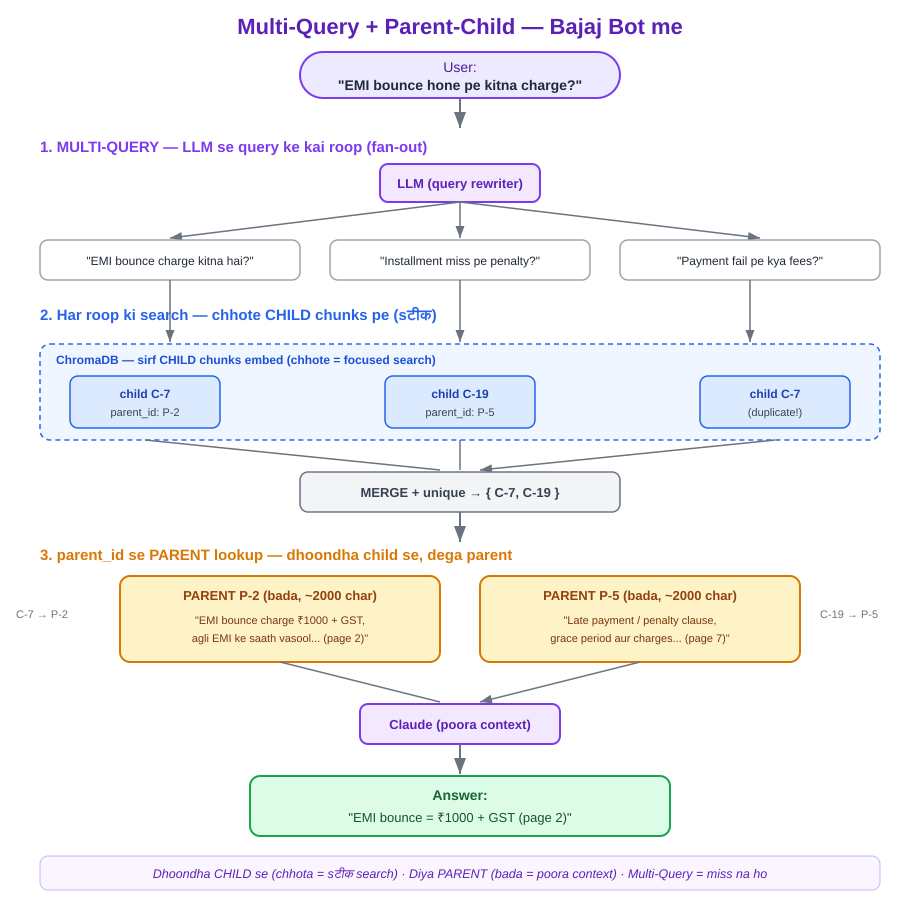
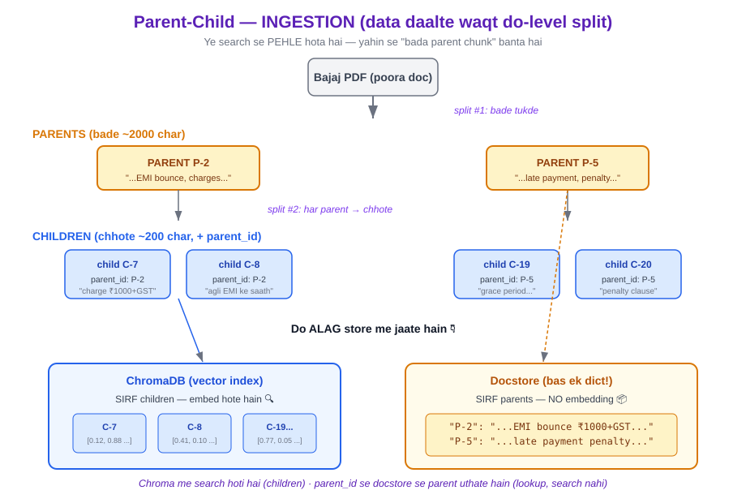

# Day 16 — Multi-Query + Parent-Child Chunking 🟣

> Phase 4 (Advanced RAG). **Do alag problem, do alag fix** — dono ek pipeline me.

---

## 1. Do problem, do fix (ek line me)

| Technique | Problem | Fix | Cost |
|-----------|---------|-----|------|
| **Multi-Query** | user ek cheez **kai wording** me poochta; ek "unlucky" wording sahi doc miss kar deti | 1 query → LLM se **3-4 roop** → sab search → **merge (unique)** | ⬆️ badhta (1 extra LLM call + kai search) |
| **Parent-Child** | chhota chunk = search sटीक par context adhura; bada chunk = context pura par search dhundhla | search **CHILD** (chhota) pe, LLM ko do **PARENT** (bada) | ≈ free (koi extra LLM call nahi) |

**Recurring lesson:** dono OPTIONAL hain. Default = simple RAG. Ye tab lagao jab asli problem dikhe + **eval (Day 12)** se fayda prove ho. (Day 14 HyDE, Day 15 Re-rank — wahi baat.)

---

## 2. Multi-Query (fan-out)



- Embeddings **shabd ke roop** pe react karte (Day 2 "din" wala case). Ek wording weak match de sakti.
- Fix: LLM se same matlab ke **kai roop** banwao → har roop apni search → results **jodo**, duplicate hatao.
- Recall ⬆️ (zaroori doc miss hone ka chance girta). **Cost bhi ⬆️** — isliye optional.
- Frontend bridge: **fan-out** — ek cheez ke multiple variants parallel fetch, taaki koi result chhoote na.
- ⚠️ Side-effect: kabhi **extra/related** doc bhi kheench laata (precision ↓) → Re-rank (Day 15) se neeche karo. Sab tools jud te hain.

---

## 3. Parent-Child — search alag, context alag

**Taraazu (trade-off):** search ke liye chhota chunk chahiye (focused), context ke liye bada (pura paragraph). Parent-Child dono deta.

> **Dhoondha CHILD se (chhota = sटीक), diya PARENT (bada = pura context).**
> Yahi Day 14/15 wala pattern: *jis pe search karo, zaroori nahi wahi LLM ko do.*

### Ingestion (data daalte waqt) — "bada chunk aaya kahan se?"



Doc ko daalne se pehle **DO baar** todte hain:
- **split #1:** doc → bade **PARENTS** (~2000 char) → ek simple **`dict` (docstore)** me. **NO embedding.** 📦
- **split #2:** har parent → chhote **CHILDREN** (~200 char) → **ChromaDB me embed.** 🔍
- Har child apni metadata me **`parent_id`** rakhta (foreign key / DB `parent_id` / `element.parentNode` jaisa pointer). 🔗

**Toh ChromaDB me sirf CHILDREN hain. Parent alag `dict` me pada hai.** Simple chunking (Day 1-15) me aisa nahi tha — wahan ek hi split, aur *jo chunk search hota wahi LLM ko jaata*.

### Retrieve time
1. Query → child pe search (सटीक match).
2. Matched child ka `parent_id` dekho → docstore se **poora parent utha lo** — ye **lookup** hai (`dict[parent_id]`), **search nahi**.
3. Ek parent ke kai children match ho to → **merge** hoke ek hi parent (unique).

> **Search = child (dhoondhna). Lookup = parent (id se seedha uthana).** Ye farak yaad rakho.

---

## 4. LIVE result (bajaj corpus, File 1 scratch)

Query: *"EMI bounce hone pe kitna charge lagega?"*
```
MULTI-QUERY roop:  original + 3 (penalty amount / kitni fees kategi / bank extra charge)
Matched CHILDREN:  P-0-c1, P-0-c3, P-1-c2, P-1-c3   (4 chhote)
Unique PARENTS:    P-0, P-1                          (2 bade — child→parent collapse)
ANSWER: "EMI bounce = Rs 1000 + GST, agli EMI ke saath vasool, CIBIL bhi girta"
```
- **Parent-Child ka fayda saaf:** answer me "agli EMI ke saath" + "CIBIL girता" **bhi** aaya — ye chhote child me nahi tha, **poore parent** se aaya. Simple RAG hota to jawab **adhura**.
- `P-0-c1` + `P-0-c3` dono **ek hi parent P-0** ke → merge → ek P-0.

---

## 5. 🐛 Library ka keeda + FIX (future ke liye — File 2)

`MultiQueryRetriever` ka **default parser har newline ko ek query** maan leta hai. LLM aksar upar ek **intro line** deta:
```
Generated queries: ['Here are 3 different versions of the question:',  ← ye QUERY nahi!
                    'EMI bounce पर कितना penalty...', ...]
```
Wo bekaar intro line bhi "query" ban ke search ho gayi → **galat doc** (Prepayment/foreclosure) aaya → precision ↓.

**Kyun scratch me nahi aaya?** File 1 me humne khud LLM ko *"koi number/bullet nahi"* bola + output strip kiya. **Scratch-first ka fayda** — andar ka pata tha to keeda pakda (jaise Day 7 BFL_chatbot, Day 12 RAGAS).

**FIX (File 2 me maujood):** apna `CleanLineParser` do jo (a) numbering/bullet hataye, (b) `:` pe khatam / `?` na wali intro line **chhaan de**. Custom prompt + `prompt | llm | parser` LCEL chain → `MultiQueryRetriever(retriever=..., llm_chain=clean_chain)`.
```
DEFAULT (buggy): 3 parents  → foreclosure (kachra) ghusa
CLEAN  (fixed):  2 parents  → foreclosure gayab, sirf sahi
```
> **Sabak:** framework loop chhupa deta, par default behaviour hamesha ideal nahi. Custom parser/prompt se control wapas lo.

---

## 6. Library version (File 2) — 2 wrappers

| Kaam | Scratch (File 1) | Library (File 2) |
|------|------------------|------------------|
| ingestion (2-split + docstore + pointer) | `dict` + loop + `parent_id` khud | `ParentDocumentRetriever.add_documents()` — 1 line |
| child search → parent lookup | cosine + `docstore[pid]` khud | `parent_retriever.invoke(q)` — andar chhupa |
| query ke roop + merge | `multi_query()` + `set()` | `MultiQueryRetriever` — andar chhupa |
| **jodna** | 2 function manual | `MultiQueryRetriever(retriever=parent_retriever)` — nest |

- **docstore = `InMemoryStore()`** (= wahi `dict`). **children = Chroma vectorstore.**
- `parent_splitter=None` → har input Document khud ek parent (4 policy = 4 parent, File 1 jaisa).
- `child_splitter=RecursiveCharacterTextSplitter(chunk_size=100, ...)` → chhote children.
- Jodne ka jaadu: `MultiQueryRetriever` ka **base retriever = ParentDocumentRetriever** → roop banao → har roop child-search → parents lao → merge. Poora File-1 flow, bas loop/dict dikh nahi rahe.

---

## 7. Kab lagao / kab nahi
- **Multi-Query ✅:** users bahut alag wording me poochte, recall kam lag raha. ❌ latency/cost tang, ya recall pehle hi theek.
- **Parent-Child ✅:** search sahi doc dhoondh raha par jawab **adhura** (context kata). ❌ chunks pehle hi sahi context de rahe.
- **Routing note:** Day 11 routing = konsa **SOURCE**. Ye = konsi **TECHNIQUE**. Aage **Day 17-18 (Agentic RAG)** me LLM **khud decide** karega konsa tool — wahi asli "routing".

---

## 8. Jargon
- **Multi-Query** = ek query ke kai LLM-generated roop, sab search, results merge.
- **Parent-Child** = 2-level chunk: child (chhota, embed/search) + parent (bada, docstore/return).
- **docstore** = `id → text` ka simple store (`InMemoryStore`/`dict`), parents rakhne ko. Koi embedding nahi.
- **parent_id** = child me parent ka pointer (foreign key).
- **fan-out** = ek input se kai parallel calls.

## Mentor comparison
_(TODO: coding_ninja_genai me multi-query / parent-child / MultiQueryRetriever dhoondhna. Abhi tak scratch-first kiya.)_
