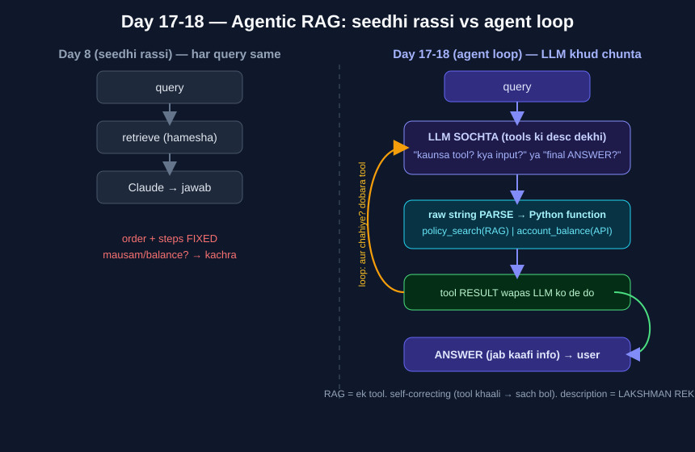

# Day 17-18 — Agentic RAG (RAG + tool use) 🟣

> Phase 4 ka final topic. Ab tak RAG ko *smart* banaya (HyDE, re-rank, multi-query).
> Aaj RAG ko *soch-kar-decide* karna sikhaya. **RAG ab ek TOOL hai agent ke haath me.**

---

## 1. Problem: seedhi rassi har query ke liye ek jaisi
Day 8 ka RAGBot: `query → retrieve → Claude → jawab` — **hamesha same steps, same order**.
- "EMI bounce charge?" → retrieve sahi ✅
- "Delhi mausam?" → retrieve = **kachra** (doc me hai hi nahi) → token waste + bad UX ❌
- "Mera balance?" → **doc me ho hi nahi sakta** (live data) → API/DB chahiye ❌

Alag query → alag **raasta** chahiye. Kaun decide kare? Seedhi rassi decide nahi kar sakti.

CleanLineParser## 2. Agent = LLM ko TOOLS do, woh KHUD chune kab kaunsa
Day 11 (routing) me maine likha tha: *"LLM DECIDING not just answering = agents ki jhalak."*
Aaj woh seed uga. LLM ab sirf jawab nahi deta — **sochta hai "kaunsa tool + kya input"**, tool chalta hai, result wapas LLM ko, phir zaroorat ho to dobara tool, warna final jawab.

### Tool ki 3 cheezein
1. **name** → `policy_search` (pehchaan)
2. **description** → LLM ke liye tool ka **manual** (role + kaam + **LIMIT**). LLM ISI ko padh ke chunta.
3. **function** → asli Python kaam (hamara RAG / API).

## 3. Asli "jaadu" = parsing (Vijay ne khud pakda 😎)
LLM sirf **raw string** deta hai (`"policy_search chalao"`). Woh khud function nahi chala sakta.
**Hum us string ko program me PARSE karke sahi Python function call karte hain.** Bas yahi agent loop.
- Scratch me: `TOOL: x | INPUT: y` format + regex se parse (`TOOL_RE`).
- Library me: Claude ka **native tool-calling** (structured), LangChain andar parse karta.
- Purana connect: Day 9 `PydanticOutputParser`, Day 12 judge-score parse — wahi soch, ab function bhi chalta hai.

## 4. Live results (scratch, 01_...)
| Query | Agent ne kya kiya | Steps |
|-------|-------------------|-------|
| EMI bounce charge? | `policy_search` (RAG) → jawab | 2 |
| Balance VJ-100? | `account_balance` (API), **VJ-100 khud nikaala** query se | 2 |
| Delhi mausam? | koi tool NAHI → seedha "jaankari nahi" | 1 |
| **combined**: VJ-100 ki EMI bounce + balance? | policy_search → account_balance → jawab | **3** |

**3 badi baatein:**
- **Input KHUD nikaalta** — humne kabhi "account_id=VJ-100" nahi bola; LLM ne query se nikaala. (Router se aage.)
- **Steps flexible** — kabhi 1, kabhi 3. Loop ek-ek tool chalata (roadmap ka "one step at a time"). Order **LLM** decide karta, fixed nahi.
- **Self-correcting** — `VJ-999` (account hai hi nahi) → tool bola "nahi mila" → agent ne jhooth nahi bola, sach bataya. (Day 8 threshold + Day 12 faithfulness wali anti-hallucination, ab agent ke andar.)

## 5. Library (02_...) = same loop, `AgentExecutor` ke andar chhupa
3 cheez di: **tools** (`@tool`, docstring = description), **llm** (`ChatAnthropic`, tool-calling jaanta), **prompt** (+ `{agent_scratchpad}` = scratch ke `messages[]` ka framework version).
`create_tool_calling_agent` + `AgentExecutor(verbose=True)`. verbose me dikha `Invoking: policy_search with {...}` = humara scratch ka "TOOL: ... INPUT: ...".
Day 15/16 jaisa: loop framework ke andar; scratch-first se andar ka pata hai.

## 6. 🐛 Description = LAKSHMAN REKHA (aaj ka bug — do experiment)
- **Try A (jhoothi/colliding desc):** balance tool ko bola "main policy ka hoon". **Do baar** try — Claude ne **DONO baar SAHI tool chuna!** Kyun? tool ka **naam + saare tools ki desc ek saath** cross-check hote hain → ek jhoothi line fool nahi karti. **Modern tool-calling robust hai.** => "kharab desc = pakka galat" GALAT dawa.
- **Try B (under-scoped desc) — reliable failure:** `policy_search` desc ko sikoda: *"sirf foreclosure, EMI bounce NAHI"*. EMI query pe agent ne tool **chalaya hi nahi** (`Invoking:` line gayab) → bola *"main directly bata sakta hoon"* → **apni yaaddasht se jawab = HALLUCINATION** (grounding toota, Day 12). Data doc me tha, phir bhi RAG na chala.

**Seekh:** desc na zyada tight (tool bhookha → RAG bekaar + hallucination), na zyada dheeli (reliability girti). Bilkul theek daayra likho.

## 7. TODO — mentor comparison (next session)
`coding_ninja_genai/05_Agentic_AI/` + `Projects/BFL_chatbot/app/bajaj_tools.py` dekhna — mentor ne tools kaise banaye, kaunsa agent framework (LangChain agent / function-calling). Notes me "Mentor comparison" add karna.

## Jargon
- **Agent** = LLM + tools, khud decide kaunsa tool kab.
- **Tool** = ek function + description (LLM ka manual).
- **agent loop / ReAct** = soch(LLM) → karm(tool) → observe(result) → phir soch → ... → jawab.
- **agent_scratchpad** = agent ki chalti memory (steps + results).
- **self-correcting** = tool result bura/khaali → agent apna jawab uske hisaab se badle.

## Koi nayi library nahi
Sab LangChain (Day 9) ke andar: `@tool`, `create_tool_calling_agent`, `AgentExecutor`.
