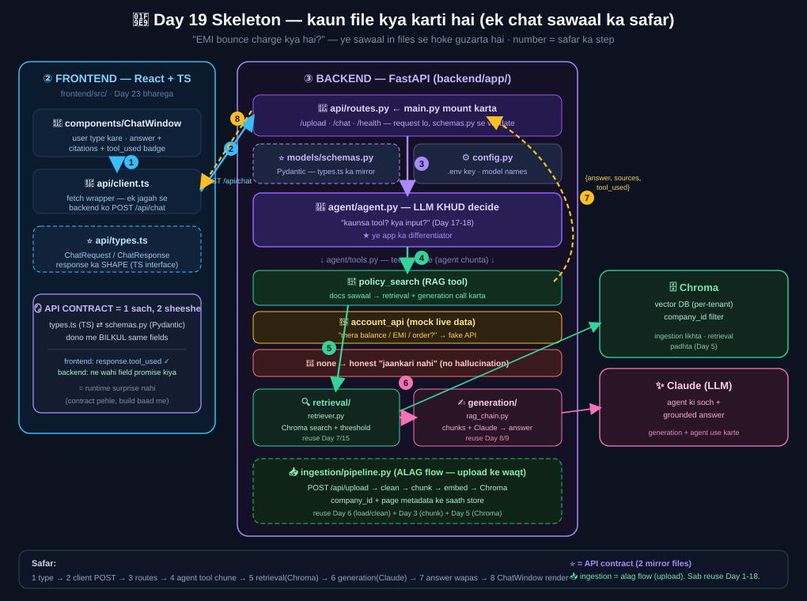

# Day 19 — Design & Architecture (Phase 5 shuru 🟠)

> Aaj **code nahi** — blueprint. "Pehle TS interface + API contract, phir eent." Frontend dev ki
> comfort zone. Poora plan: [`../docs/capstone-roadmap.md`](../docs/capstone-roadmap.md).

## Kya decide hua (locked)
- **Repo:** `rag-mastery/capstone/` (alag repo nahi, isi ke andar).
- **Seed corpus:** Bajaj policy (Day 6 ke 40 chunks). ⚠️ Ye sirf **seed/dummy data** hai (React app
  ke dummy data jaisa) — app ki limitation NAHI. Product to "koi bhi PDF upload karo" hai hi.
  Bajaj isliye: ready+tested, finance me `account_api` mock natural, demo-ready.

## Sabse bada concept aaj: **API contract = single source of truth**
- Backend **Pydantic schema** (`models/schemas.py`) aur frontend **TS interface** (`api/types.ts`)
  = ek hi shape ke DO sheeshe. Dono ko match rakho.
- Agar backend `tool_used` bhejta hai → frontend interface me bhi `tool_used` hona chahiye,
  warna runtime surprise. **Contract pehle fix, phir dono taraf build.**

Contract (3 endpoints):
```
POST /api/upload  (file, company_id)     -> { doc_id, chunks, status }
POST /api/chat    { company_id, question} -> { answer, sources[], tool_used }
GET  /api/health                          -> { status: "ok" }
```

## 🧩 Skeleton — kaun file kya karti hai (dots connect)


## Folder skeleton banaya (hireflow-style)
`backend/app/{ingestion,retrieval,generation,agent,api,models}` + `frontend/src/{api,components,pages}`.
- Har backend module me docstring: **kaunsa Day bharega + kaunsa purana Day reuse**.
  (ingestion=Day6/3/2/5, retrieval=Day7/15, generation=Day8/9, agent=Day17-18.)
- Yaani capstone = poore Day 1-18 ka sab ek app me jud jaana. Kuch naya RAG-concept nahi;
  naya sirf **API layer (FastAPI) + React frontend + inhe jodna**.

## Agent = differentiator (yaad)
3 raaste: `policy_search` (RAG) / `account_api` (mock live) / `none` (honest "nahi pata").
Tool description = **LAKSHMAN REKHA** (Day 17-18 seekh).

## Next (Day 20)
FastAPI `main.py` + CORS + `/api/health`, phir `ingestion/pipeline.py` (upload→chunk→embed→Chroma
with company_id) + `POST /api/upload`. Reuse Day 6+3+5.
