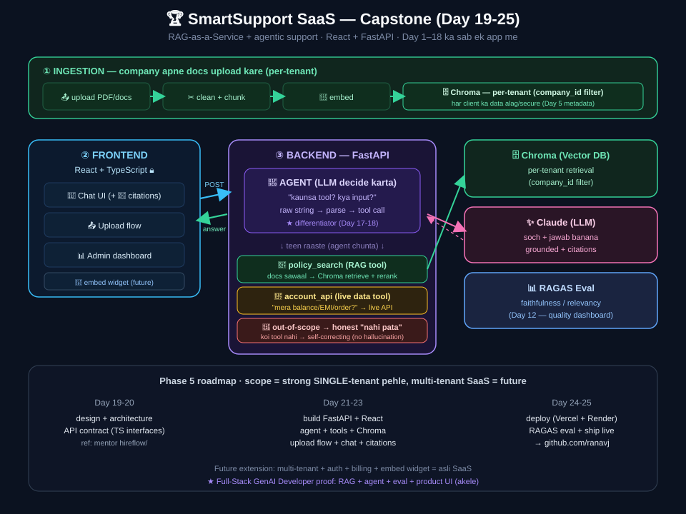

# 🏆 Capstone Vision — Kya Project Banayenge (Day 19-25)

> Yeh file batati hai rag-mastery ka FINAL project kya hoga. Day 19 pe isse start karenge.
> Decided: 2026-07-21 (learner ne confirm kiya).

---

## 🔄 UPDATE (2026-07-28) — "SmartSupport" merge + React locked

Day 17-18 (Agentic RAG) ke baad learner ne project revisit kiya. Decision: **DONO MERGE** —
Multi-Tenant RAG SaaS banega, PAR uska main differentiator = **agentic support angle**
("SmartSupport"). Yaani upload→branded bot ke saath ek **agent** jo tool chunta:
`policy_search` (RAG) vs `account_api` (live data) vs honest "nahi pata". Yeh Day 17-18 ka
naya skill hai jo original vision me nahi tha.

- **Frontend LOCKED: React + TypeScript** (Angular drop; learner ne fix kiya).
- Architecture diagram (draft): ingestion (upload, per-tenant) + React frontend + agent (3 tools)
  + Chroma + Claude + RAGAS. Day 19 pe refine karenge (tools final + API contract + TS interfaces).

- Realistic scope wahi: Day 19-25 = strong single-tenant version (agent ke saath), multi-tenant
  + auth + billing = post-course extension.

---

## 🎯 North Star: Multi-Tenant RAG SaaS ("RAG-as-a-Service")

Ek platform jahan **koi bhi company** sign-up kare → apne **docs upload** kare →
apna **branded Q&A bot** turant paaye (website pe embed kar sake). Har client ka data **alag/secure**.

**Kyun yeh best hai:** baaki RAG products (Q&A bot, support bot, search) ek FEATURE hain —
yeh ek poora PRODUCT hai, sab uske andar aa jaate hain. Aur yeh 80% frontend/full-stack +
20% RAG engine = learner ki frontend seniority (11 yrs) + nayi RAG skill dono chamakti hai.

---

## 🧬 Ismein saari rag-mastery skills lagengi

| Piece | Skill (Day) |
|-------|-------------|
| Docs ingest (upload→chunk→embed→store) | Day 3, 5, 6 |
| Multi-tenant isolation (`company_id` metadata filter) | Day 5 + Day 8 bonus |
| Tuned retrieval + citations | Day 6, 7 |
| Multi-source routing (per client) | Day 11 |
| Evaluation (quality dashboard) | Day 12-13 |
| **Full-stack UI (upload flow + chat + admin dashboard + embed widget)** | **Learner's 11 yrs frontend ⭐** |

---

## 📐 Realistic plan (imaandaar scoping)

**Full multi-tenant SaaS (auth + billing + scale) = mahino ka kaam.** Isliye:

- **Day 19-25 capstone:** ek STRONG single-tenant version banao —
  upload → chat → citations → eval → achhi UI. 80% wow-factor.
  Reference structure: mentor ka `Projects/hireflow` (ingestion/retrieval/generation/api folders).
- **Baad me (post-course):** multi-tenant + auth + billing extend karke ASLI SaaS bana lo.

---

## 🛠️ Tech stack (planned)
- **Frontend:** React + TypeScript (LOCKED 2026-07-28) — upload UI, chat, admin dashboard
- **Backend:** FastAPI (RAG engine ko API banao — Day 8 RAGBot pattern)
- **RAG:** Chroma + sentence-transformers + Claude (jo ab tak use kiya)
- **Structure:** hireflow-style folders (ingestion / retrieval / generation / api)

---

## ⭐ Why this = career-defining
- **AI-only devs** yeh nahi bana sakte (UI/product nahi jaante)
- **Frontend-only devs** yeh nahi bana sakte (RAG nahi jaante)
- Learner = DONO → "Full-Stack GenAI Developer" → rare + high-demand
- Portfolio proof: live SaaS on github.com/ranavj

---

## 🔗 Aage Agents se connect
Agents module ke baad, is SaaS mein **agentic features** add kar sakte:
agent jo docs khud organize kare, ya support-queries auto-resolve kare (RAG + tools).
Toh yeh capstone Agents module ke saath aur bada ho sakta hai.

## 📌 Do vision diagrams (motivation ke liye)
- RAG-complete pe kya bana sakte: (Q&A bot, support bot, search, research, SaaS...)
- Agents-complete pe kya bana sakte: (code-review agent, support-agent-auto-resolve,
  research agent, multi-agent system, data-analyst agent, workflow automation)
- Both point to: **Full-Stack Agentic AI Engineer** (idea → knowledge+action+UI, akele)
