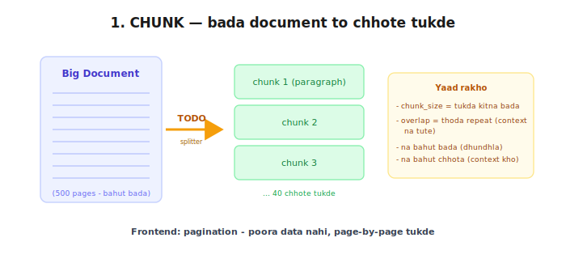
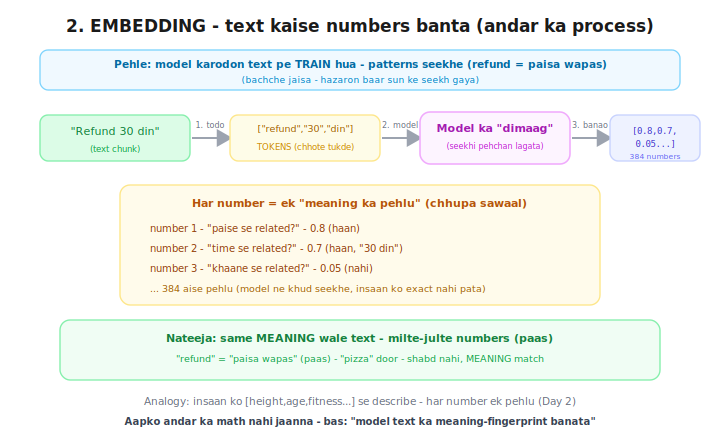
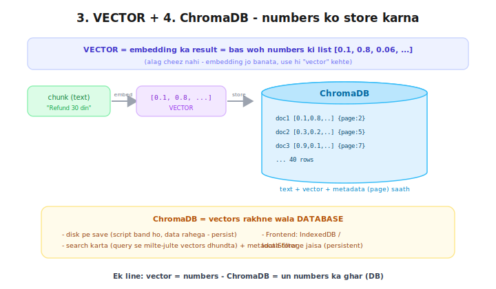
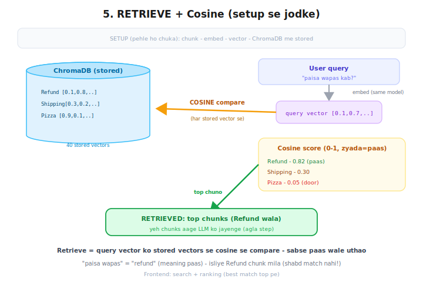
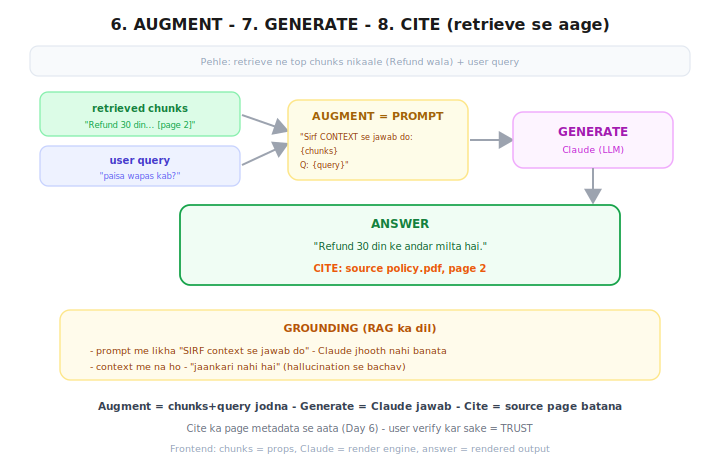
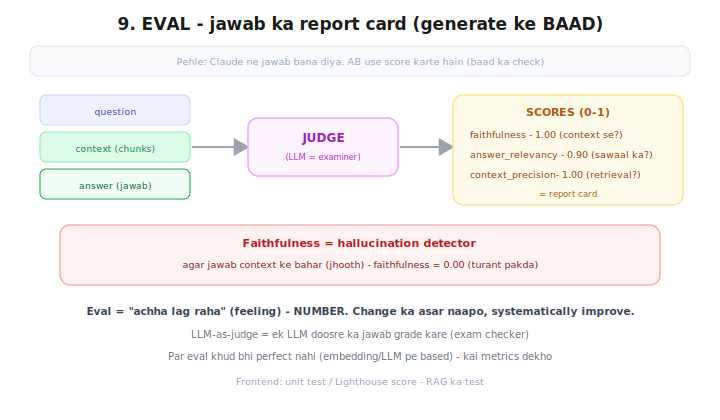
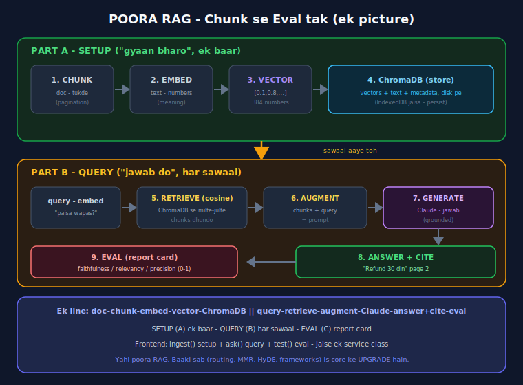

# 🔄 RAG Revision — Poora Flow, Simple Diagrams

> Confusion clear karne ke liye — har concept ka simple diagram, ek line matlab.
> Order mein padho (1 → 7). Pehla 6 = ek-ek step, 7th = sab ek saath.

---

## 📊 Poora RAG — ek line

```
SETUP (ek baar):  doc → CHUNK → EMBED → VECTOR → ChromaDB
QUERY (har sawaal): query → RETRIEVE (cosine) → AUGMENT → GENERATE (Claude) → ANSWER + CITE
CHECK:  answer → EVAL (report card)
```
Frontend: `ingest()` + `ask()` + `test()` — ek service class.

---

## 🖼️ Diagrams (order mein)

### 1. Chunk — `diagrams/1_chunk.svg`

Bada document → chhote tukde (paragraph). chunk_size + overlap. Frontend: pagination.

### 2. Embedding — `diagrams/2_embedding.svg`

Text → numbers. Model pehle train hua → ab text ka meaning-fingerprint (384 numbers) banata.
Har number = ek "pehlu". Same meaning = paas numbers.

### 3. Vector + ChromaDB — `diagrams/3_vector_chromadb.svg`

Vector = embedding ka result (numbers list). ChromaDB = un vectors ka database (disk pe, persist).

### 4. Retrieve + Cosine — `diagrams/4_retrieve_cosine.svg`

Query → vector → ChromaDB ke stored vectors se cosine compare → sabse paas chunks uthao.
"paisa wapas" ≈ "refund" (meaning, shabd nahi).

### 5. Augment + Generate + Cite — `diagrams/5_generate_cite.svg`

chunks+query = prompt (augment) → Claude → jawab (generate) → source page (cite).
Grounding: "sirf context se jawab do" (hallucination se bachav).

### 6. Eval — `diagrams/6_eval.svg`

Jawab ko score do (0-1, LLM-judge). faithfulness = hallucination detector.
Frontend: unit test / Lighthouse.

### 7. FULL FLOW (sab ek saath) — `diagrams/7_full_flow.svg`

Chunk se eval tak, ek picture. **Yahi poora RAG core — baaki sab (routing/MMR/HyDE/frameworks)
is core ke UPGRADE hain.**

---

## 📖 Ek-line dictionary
| Word | Matlab |
|------|--------|
| Chunk | text ka chhota tukda |
| Embedding | text → numbers (meaning capture) |
| Vector | woh numbers ki list [0.1,0.8,...] |
| ChromaDB | vectors ka database (disk) |
| Cosine | do vectors kitne similar (0-1) |
| Retrieve | DB se relevant chunks dhundna |
| Augment | chunks + query = prompt |
| Generate | Claude se jawab |
| Grounding | sirf context se jawab (jhooth nahi) |
| Cite | source page batana |
| Eval | jawab ka score (report card) |
